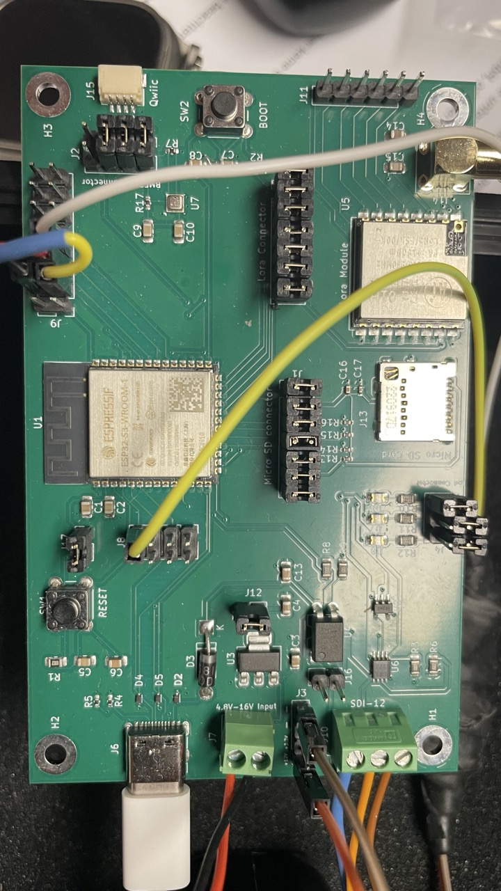
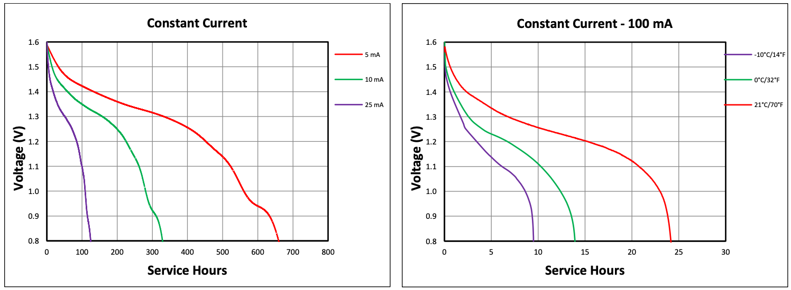
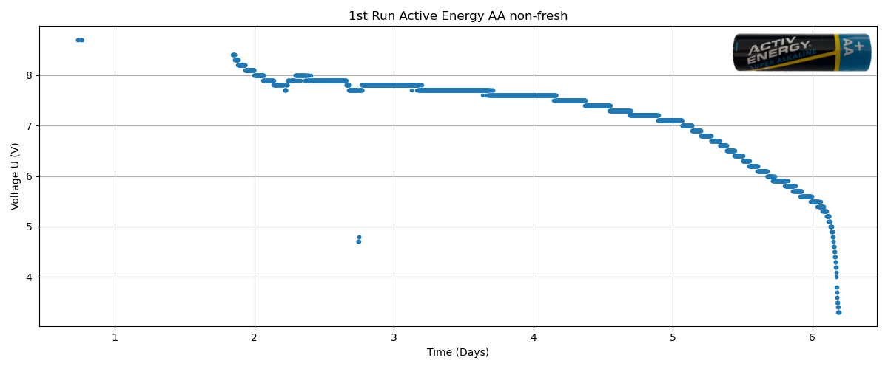
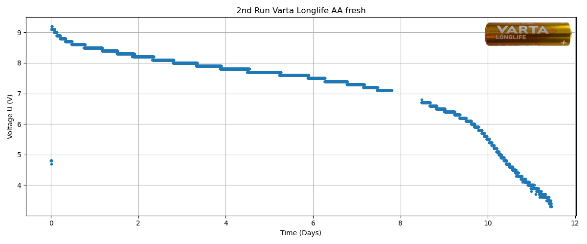

# Molenet 6.3 power consumption and voltage measurement

Alexander Förster (2026-06-28)

## Setup

All measurements are carried out with the Bad Kissingen setup. 

**Activated sensors**

- TEROS 11 soil moisture and temp sensor (external)
- DS18B20 temp sensor (external)
- BME280 temp, humidity, and air pressure sensor (internal)

**Other components**

The SD card was not connected or used in the power consumption setup, but later in the second battery run experiment. 

The LoRa module was connected adn used in both experiments. 

**Power**

Battery pack 6 x AA alkaline (not fresh)

## Power consumption measurement

The power consumption was measured manually with a benchtop multimeter multiple times over a test cycle. 


mode            | mean U | mean I  | max I  | mean t    
----            | -------| ------  | -----  | ------
active with LED | 8.30V  | 56mA    | 160mA  | 13sec 
active w/o LED  | 8.32V  | 50mA    | 154mA  | 12.7sec
sleep           | 8.43V  | 0.105mA | 0.11mA | 60sec

The LED switches on after 1-2 sec when active.   

Max is probably while sending LoRa packets. Exact measurements are required.

### How long does it run when it's updated every minute?

Two states:

- sleep 0.1mA for 60s
- active 50mA for 13s

Average: 
- (13s * 50mA + 60s * 0.1mA / 73s) = 8.8mA


Battery capacity: 
- approximately 2000mAh

Runtime:
- 2000mAh/8.8mA ~ 227h ~ 9 days
 
### How long does it run with one measurement each hour?

Two states:

- sleep 0.1mA for 3600s
- active 50mA for 13s

Average: 
- (13s * 50mA + 3600s * 0.1mA) / 3613s = 0.28mA


Battery capacity: 
- approximately 2000mAh

Runtime:
- 2000mAh/0.28mA ~ 7143h ~ 297 days

## Voltage measurement


### The circuit

The schematics of the circuit are drawn in the next image. R1 and R2 are a voltage divider for the battery voltage to convert it to the input voltage range of the ESP32. ADC should be connected to the ADC pin of the ESP32. EN should be connected to a digital output pin of the ESP32. 5V-16V should be connected to the battery and GND to the common ground of the battery and ESP32.

The BS 170 is an n-type MOSFET. Not the best choice but available at the lab. The 100nF capacitor is for reducing noise in the measurement and the resistor R3 is for pulling the gate to ground when the EN pin is open.  
   


### Voltage divider

To find the best values for the resistors, we tested various combinations of resistors. 

The input voltage (battery) should be in the range of 16 V (fully charged lead acid battery) down to 3.5 V when the ESP32 will stop working.

The ESP32 can read voltages up to 3.3 V and will not be destroyed with voltages up to 3.6 V, but the linear range of measurements is between 0.15 V and 2.45 V.    

R1 value (real) | R2 value (real)   | stddev^(*) | dangerous Voltage | limit Voltage | linear min Voltage | linear max Voltage
---- | ----- | ------ |---- | ----| ---- | ---- | 
470k | 220k | not tested | 
220k (226.0k) | 100k (098.4k) | 0.1 | 11.9 V | 10.9 V | 0.495 V | 8.08 V
47k (47.070k) | 10k (9.920k) | 0.02 | 20.6 V | 18.9 V | 0.862 V | 14.1 V
22k (21.95k) | 10k (9.92k) | 0.01 | 11.6V | 10.6V | 0.482V | 7.87V
2.2k | 1k    | 0.01 (a bit better) |
 
^(*) standard deviation of 10 measurements, 2ms between each measurement. Measured 5V via USB and 9V via battery pack. Lower values mean less noise.   

We are using R1 = 47k and R2 = 10k for our measurements.

### Calibration

For R1 and R2, you can use 1% or 5% resistors. However, measure the real resistance and put these values in the software as constants to calculate realistic battery voltage values from the analog readings of the ESP32 (see below).   

### Molenet board

The following picture shows the Molenet board with the connected sensors. 


### Software

The software is using pin 42 or 40 as the enable pin, pin 4 for analog readings. The values of R1 and R2 are set in Ohm. The program [main_battery_voltage.py](programs/main_battery_voltage.py) is for testing the voltage measurement, and the program [main.py](programs/main.py) is the standard test program for the Molenet node with TEROS12 and DS18B20 sensor.    

Here are the configutation parts fot the voltage measurement:

**Except from `main_battery_voltage.py`**

```python
# --- Voltage Divider Pin Configuration and Update Time ---
MEAS_EN_PIN = 42    # controls MOSFET
ADC_PIN = 4         # measures voltage # Attention:  Not all PINS are valid for ADC!
SLEEP_TIME_MS = 60 * 60 * 1000  # 1 hour

# --- Resistor Setup and  Voltage Divider Factor Calculation ---
R1 = 47_070 # in ohms. Here 47.070kOhm for a 47k resistor.
R2 =  9_920 # in ohms. Here 09.920kOhm for a 10k resistor.
DIVIDER_FACTOR = (R1 + R2) / R2

# --- ADC Setup ---
adc = ADC(ADC_PIN) 
adc.atten(ADC.ATTN_11DB)  # up to ~3.3V, 3.6V is absolute maximum, 
                          # the linear range is between 150mV and 2450mV 
                          # when read with read_uv().
adc.width(ADC.WIDTH_12BIT)  

```

**Exept from `main.py`**

```python
        # --- Resistor Setup and  Voltage Divider Factor Calculation ---
        self.vr_R1 = 47_070 # in ohms. Here 47.070kOhm for a 47k resistor.
        self.vr_R2 =  9_920 # in ohms. Here 09.920kOhm for a 10k resistor.
        self.vr_DIVIDER_FACTOR = (self.vr_R1 + self.vr_R2) / self.vr_R2

        # --- ADC Setup ---
        self.vr_adc = ADC(4)  # measures voltage # Attention:  Not all PINS are valid for ADC!
        self.vr_adc.atten(ADC.ATTN_11DB)  # up to ~3.3V, 3.6V is absolute maximum, 
                                          # the linear range is between 150mV and 2450mV 
                                          # when read with read_uv().
        self.vr_adc.width(ADC.WIDTH_12BIT) #  
        
        self.vr_meas_en = Pin(40, Pin.IN)  # OFF (high impedance!) controls gate to MOSFET
``` 
 
## Real experiment

However, tests from [Akkuline](https://www.akkuline.de/test/mignon-batterie-vergleich) have shown that the capacities of alkaline batteries are varying depending on the brand and type. Also, the official capacity in the data sheet is normally not the same as the one measured by an independent third party. For example, the VARTA HIGH ENERGY should have a capacity of 2264 mAh with a 250 mA load on the [data sheet](30011_VARTA_LONGLIFE_Power_AA_Datenblatt.pdf), but 1383 mAh with a 500 mA tested by [akkuline](https://www.akkuline.de/test-varta-high-energy-04906-aa-modell-2015-test-00171) when reaching 0.9 V. 

For this experiment, we used an older TEROS 12 sensor instead of a newer TEROS 11 sensor. 

Additionally, we used an additional circuit for on-board voltage measurement to estimate the battery's least capacity.

The next image shows the discharge profile from a "Duracel Basic" AA size battery from its [Data Sheet](https://cdn.prod.website-files.com/6835fa821f0f20d8b0b5851c/6899c928dedf627481a386e2_AA-Duracell.pdf). The profile depends strongly on the current (left) and on the temperture (right). All our measurements are taken at room temperatur. 



The next image shows the first run with "Active Energy Super Alkaline" (ALDI brand) batteries. Runtime was around 6 days with not-fresh batteries. 



The next image shows the second run with "VARTA longlife" batteries. Fresh batteries, but a SD-card was used to record the communication of the not-so-well-working TEROS 12 sensor for later analysis. Runtime around 11 days.  


  
## ToDo

**Power consuption**

- Measure the power consumption of the different parts of the boards separately (sensors, communication, MCU).   
- Run with various new/fresh batteries. Maybe also lithium batteries and lead acid batteries. 

**Voltage measurement**

- Calibration with real voltmeter?
- Response curve measurement for individual ESP32?
- Replacing the BS170 with a logic level MOSFET which is completely open with 3.3V on the gate. E.g. AO3400A (first) or BSS138 (second); both are only available as SMD components. ZVN2106A (first) or 2N7000 (second); Both are available as THT componets. 
- Drawings (schematics) of the connections on the Molenet board.  


